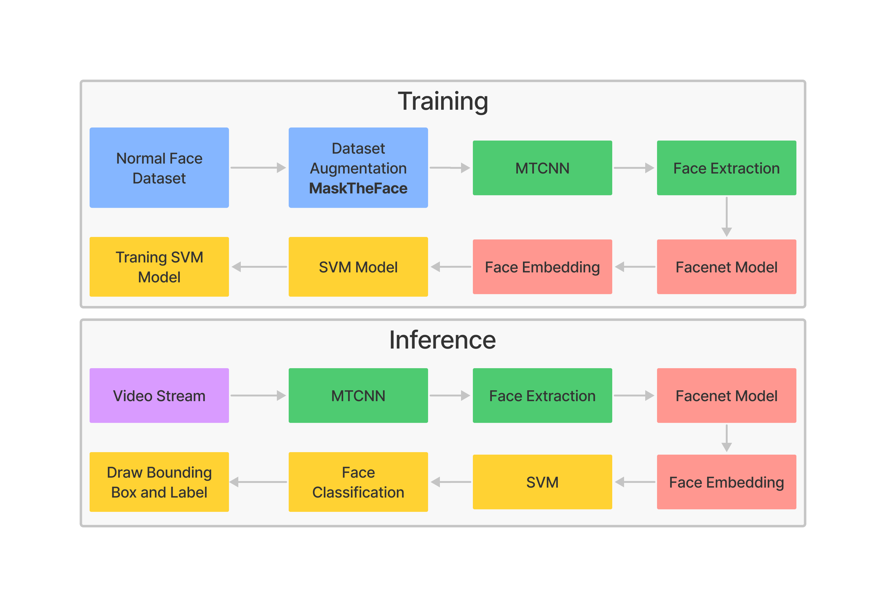

# Masked Face Recognition
This repository describes the masked face recognition process using `mtcnn` as face detection and `facenet` as face embedding. The flowchart of the process can be seen in the diagram below:

<p align="center">
    
</p>

The first process is **data augmentation**. Data augmentation is used to generate a masked face image from a normal face image. An alternative to this process is to prepare your own masked and unmasked face images.

The second process is **face detection**. The `MTCNN` (Multi-task Cascaded Convolutional Networks) model is used to detect faces. The detected faces are then extracted for embedding purposes.

The third process is **face embedding**. This process aims to generate numerical data from facial keypoints. The embedding process can be done using the `Facenet` model. In this case, we only need to make predictions using the facenet model, where the prediction results from the facenet model are the required embedding data.

The last process is **face classification**. This process will compare the face embedding of the training data with the embedding of the face of the testing data. SVM (Support Vector Machine) is used as a classification algorithm. Embedding data that has been obtained previously will be used as training data for the SVM model.

Furthermore, the inference stage of the video stream can be carried out. The results of the inference can be seen in the video below:
<p align="center">
    
</p>


## Install Requirement
Clone this repo first
```
git clone https://github.com/ruhyadi/masked-face-recognition
```
Then install requirements
```
cd masked-face-recognition
pip install -r requirements.txt
```

## Dataset Augmentation
In making data augmentation, I use MaskTheFace to synthesize normal face data into masked face data. Follow the following [link](https://github.com/aqeelanwar/MaskTheFace) for more details.

## Training Model
The training referred to here is the process of obtaining keypoint embeding data from masked and normal faces that were previously obtained. The training process can be done through the script below:
```
python train.py \
    --dataset ./datasets/ \
    --model ./model/facenet_keras.h5 \
    --faces_output ./dataset/faces.npz \
    --embedd_output ./dataset/embedd.npz
```
Facenet model can be downloaded on this [drive](https://drive.google.com/drive/folders/12aMYASGCKvDdkygSv1yQq8ns03AStDO_?usp=sharing).

## Inference
Inference process can be done with script bellow:
```
python stream.py \
    --vis \
    --write \
    --video ./videos/masked02.mp4 \
    --model ./model/facenet_keras.h5 \
    --embedding_data ./database/embedd.npz \
    --output ./videos/output.mp4
```

## Acknowledgment
- [DeepFace](https://github.com/serengil/deepface)
- [FaceNet](https://github.com/davidsandberg/facenet)
- [MTCNN](https://github.com/ipazc/mtcnn)
- [Machine Learning Mastery](https://machinelearningmastery.com/)